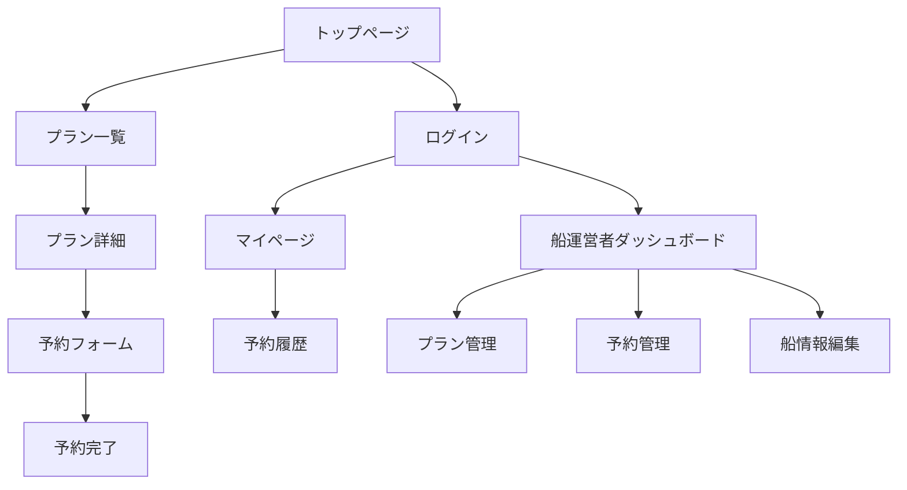

# 🎣 釣り予約サイト：要件定義書

**最終更新**: 2025-10-13  
**バージョン**: 2.0  
**ステータス**: 確定版（実装開始可能）

---

## 📋 1. プロジェクト概要

### 1.1 目的・ビジョン
釣り船をオンラインで簡単に検索・予約できるプラットフォームを構築し、釣り客と船運営者の双方にとって利便性の高いサービスを提供する。

### 1.2 対象ユーザー
| ユーザー種別 | 主な目的 | 重要度 |
|-------------|----------|--------|
| **一般釣り客** | プランの検索・予約・管理 | 最高 |
| **釣り船運営者** | プランの管理・予約状況確認 | 高 |
| **サイト管理者** | 全体の監視・運営・サポート | 中 |

### 1.3 成功の定義（KPI）
- **利用率**: 月間アクティブユーザー100名以上
- **予約率**: 検索からの予約転換率20%以上
- **満足度**: ユーザー評価4.0/5.0以上
- **運営効率**: 船運営者の管理作業時間50%削減

### 1.4 MVP スコープ
**✅ 含むもの**
- プラン検索機能（魚種・日付・船名）
- プラン詳細ページ・予約フォーム
- 船運営者によるプラン管理
- 基本的な認証・権限管理

**❌ 含まないもの（次フェーズ）**
- オンライン決済
- 高度な管理者機能
- 多言語対応
- モバイルアプリ

---

## 🎯 2. 機能要件（ユーザーストーリー形式）

### 2.1 一般ユーザー（釣り客）向け機能

#### 🔍 F001: プラン検索機能
**ユーザーストーリー**: 「釣り客として、希望する条件でプランを探したい」

| 機能ID | 機能名 | 詳細 | 優先度 | MVP |
|--------|--------|------|---------|-----|
| F001-1 | 条件検索 | 魚種・日付・料金範囲・エリアでフィルタ | 必須 | ✅ |
| F001-2 | 船名検索 | ヘッダー検索窓から船名で直接検索 | 必須 | ✅ |
| F001-3 | 検索結果表示 | カード形式で一覧表示、ページネーション | 必須 | ✅ |
| F001-4 | 詳細ページ遷移 | 検索結果から詳細ページへ | 必須 | ✅ |

#### 📋 F002: プラン詳細・予約機能
**ユーザーストーリー**: 「釣り客として、プランの詳細を確認して予約したい」

| 機能ID | 機能名 | 詳細 | 優先度 | MVP |
|--------|--------|------|---------|-----|
| F002-1 | 詳細情報表示 | 料金・時間・魚種・定員・集合場所等 | 必須 | ✅ |
| F002-2 | 予約フォーム | 日付・人数・連絡先入力 | 必須 | ✅ |
| F002-3 | 予約確認メール | 自動送信（テンプレート） | 必須 | ✅ |
| F002-4 | 空き状況確認 | リアルタイムでの定員チェック | 推奨 | 🔶 |

#### 👤 F003: ユーザー管理機能
**ユーザーストーリー**: 「釣り客として、自分の予約を管理したい」

| 機能ID | 機能名 | 詳細 | 優先度 | MVP |
|--------|--------|------|---------|-----|
| F003-1 | 会員登録・ログイン | （メール認証は不要）による登録 | 必須 | ✅ |
| F003-2 | マイページ | プロフィール・予約履歴表示 | 必須 | ✅ |
| F003-3 | 予約履歴 | 過去・今後の予約一覧と詳細 | 必須 | ✅ |
| F003-4 | プロフィール編集 | 氏名・電話番号の変更 | 必須 | ✅ |

### 2.2 釣り船運営者向け機能

#### 🚢 F004: プラン管理機能
**ユーザーストーリー**: 「船運営者として、自分の船のプランを管理したい」

| 機能ID | 機能名 | 詳細 | 優先度 | MVP |
|--------|--------|------|---------|-----|
| F004-1 | プラン作成 | 新規プラン登録フォーム | 必須 | ✅ |
| F004-2 | プラン編集・削除 | 既存プランの修正・削除 | 必須 | ✅ |
| F004-3 | プラン一覧表示 | 自船のプラン一覧表示 | 必須 | ✅ |
| F004-4 | 公開・非公開設定 | プランの表示制御 | 推奨 | 🔶 |

#### 📅 F005: 予約管理機能
**ユーザーストーリー**: 「船運営者として、予約状況を確認・管理したい」

| 機能ID | 機能名 | 詳細 | 優先度 | MVP |
|--------|--------|------|---------|-----|
| F005-1 | 予約一覧表示 | 日付別・プラン別の予約状況 | 必須 | ✅ |
| F005-2 | 予約詳細確認 | 予約者情報・連絡先の確認 | 必須 | ✅ |
| F005-3 | 予約ステータス変更 | 承認・キャンセル・完了の管理 | 推奨 | 🔶 |
| F005-4 | カレンダー表示 | 月間予約状況のカレンダー | 推奨 | ❌ |

#### 🏢 F006: 船舶情報管理
**ユーザーストーリー**: 「船運営者として、自分の船の情報を管理したい」

| 機能ID | 機能名 | 詳細 | 優先度 | MVP |
|--------|--------|------|---------|-----|
| F006-1 | 基本情報編集 | 船名・連絡先・紹介文の編集 | 必須 | ✅ |
| F006-2 | 写真アップロード | 船・設備の写真登録 | 推奨 | 🔶 |
| F006-3 | 営業時間設定 | 出船可能時間・定休日設定 | 推奨 | ❌ |

### 2.3 管理者向け機能

#### 🛡️ F007: システム管理機能
**ユーザーストーリー**: 「管理者として、サイト全体を監視・運営したい」

| 機能ID | 機能名 | 詳細 | 優先度 | MVP |
|--------|--------|------|---------|-----|
| F007-1 | 船運営者アカウント管理 | 新規登録・削除・権限設定 | 必須 | ✅ |
| F007-2 | ユーザー管理 | 一般ユーザーの一覧・停止 | 推奨 | 🔶 |
| F007-3 | 問い合わせ対応 | トラブル報告の受領・対応 | 推奨 | 🔶 |
| F007-4 | データ分析 | 利用状況・予約統計の確認 | 低 | ❌ |

**凡例**: ✅必須(MVP), 🔶推奨(Phase2), ❌将来(Phase3+)

---

## ⚡ 3. 非機能要件

### 3.1 パフォーマンス要件
| 項目 | 指標 | 目標値 | 測定方法 |
|------|------|--------|----------|
| ページ読み込み | First Contentful Paint | 1.5秒以内 | Lighthouse |
| 検索応答時間 | API Response Time | 2秒以内（P95） | サーバーログ |
| 同時接続数 | Concurrent Users | 100名 | 負荷テスト |
| データベース | Query Response | 500ms以内（P90） | APM監視 |

### 3.2 セキュリティ要件
| 分類 | 要件 | 実装方法 |
|------|------|----------|
| 通信暗号化 | HTTPS必須 | SSL証明書・HSTS |
| 認証・認可 | JWT/Session管理 | NextAuth.js |
| パスワード | ハッシュ化必須 | bcrypt（Rounds:12） |
| CSRF対策 | トークン検証 | built-in CSRF protection |
| XSS対策 | 入力サニタイゼーション | React標準・validator.js |
| SQLインジェクション | パラメータ化クエリ | Prisma ORM |

### 3.3 可用性・運用要件
| 項目 | 目標値 | 実装方法 |
|------|--------|----------|
| 稼働率 | 99.0%以上 | ヘルスチェック・自動復旧 |
| RPO（復旧目標時点） | 24時間 | 日次バックアップ |
| RTO（復旧目標時間） | 4時間 | 手動復旧手順書 |
| ログ保持期間 | 90日間 | ローテーション設定 |

### 3.4 ユーザビリティ要件
| 項目 | 要件 | 検証方法 |
|------|------|----------|
| レスポンシブ対応 | スマホ・タブレット・PC | 実機テスト |
| アクセシビリティ | WCAG 2.1 AA準拠 | axe-core検証 |
| ブラウザ対応 | Chrome/Safari/Edge最新2バージョン | クロスブラウザテスト |
| 操作性 | キーボードナビゲーション対応 | Tab移動確認 |

### 3.5 保守性・開発要件
| 項目 | 要件 | 実装方法 |
|------|------|----------|
| コード品質 | ESLint/Prettier準拠 | CI/CDパイプライン |
| 型安全性 | TypeScript strict mode | コンパイル時チェック |
| テストカバレッジ | 70%以上 | Jest・Testing Library |
| ドキュメント | API・機能仕様書 | OpenAPI・Storybook |

---

## 🗂️ 4. データモデル設計

### 4.1 エンティティ関係図（概念）
```
User (ユーザー)     1:N     Booking (予約)
                             ↓ N:1
Boat (船舶)        1:N     FishingPlan (プラン)
                             ↑ 1:N
Admin (管理者)     1:N     Report (報告)
```

### 4.2 テーブル定義

#### 👤 User テーブル
```typescript
interface User {
  id: string;           // UUID
  email: string;        // ログインID（一意）
  password: string;     // ハッシュ化済み
  name: string;         // 氏名
  phone?: string;       // 電話番号
  role: 'user' | 'owner' | 'admin'; // 権限
  isActive: boolean;    // 有効/無効
  createdAt: Date;
  updatedAt: Date;
}
```

#### 🚢 Boat テーブル
```typescript
interface Boat {
  id: string;           // UUID
  name: string;         // 船名
  ownerId: string;      // User.id（船長）
  area: string;         // エリア（三浦半島等）
  contact: string;      // 連絡先
  description?: string; // 紹介文
  imageUrl?: string;    // 船の写真
  isActive: boolean;    // 営業中/休業中
  createdAt: Date;
  updatedAt: Date;
}
```

#### 🎣 FishingPlan テーブル
```typescript
interface FishingPlan {
  id: string;           // UUID
  boatId: string;       // Boat.id
  title: string;        // プラン名
  description: string;  // 説明
  fishTypes: string[];  // 対象魚種
  price: number;        // 料金（円）
  maxCapacity: number;  // 定員
  departureTime: string; // 出船時間（HH:mm）
  returnTime: string;   // 帰港時間（HH:mm）
  meetingPlace: string; // 集合場所
  availableDays: string[]; // 実施曜日
  imageUrl?: string;    // プラン画像
  isActive: boolean;    // 公開/非公開
  createdAt: Date;
  updatedAt: Date;
}
```

#### 📅 Booking テーブル
```typescript
interface Booking {
  id: string;           // UUID
  planId: string;       // FishingPlan.id
  userId: string;       // User.id
  bookingDate: Date;    // 予約日
  headcount: number;    // 参加人数
  status: 'pending' | 'confirmed' | 'cancelled' | 'completed';
  customerName: string; // 予約者名
  customerPhone: string; // 連絡先
  specialRequests?: string; // 特記事項
  totalAmount: number;  // 合計金額
  createdAt: Date;
  updatedAt: Date;
}
```

---

## 🔌 5. API仕様書

### 5.1 認証API

#### POST /api/auth/register
**用途**: ユーザー登録
```typescript
// Request
{
  email: string;
  password: string;
  name: string;
  phone?: string;
}

// Response
{
  user: User;
  token: string;
}
```

#### POST /api/auth/login
**用途**: ログイン
```typescript
// Request
{
  email: string;
  password: string;
}

// Response
{
  user: User;
  token: string;
}
```

### 5.2 プラン検索API

#### GET /api/plans
**用途**: プラン検索・一覧取得
```typescript
// Query Parameters
{
  fishType?: string;    // 魚種フィルタ
  area?: string;        // エリアフィルタ
  date?: string;        // 日付フィルタ（YYYY-MM-DD）
  boatName?: string;    // 船名検索
  minPrice?: number;    // 最低料金
  maxPrice?: number;    // 最高料金
  page?: number;        // ページ番号
  limit?: number;       // 件数（デフォルト20）
}

// Response
{
  plans: FishingPlan[];
  total: number;
  page: number;
  totalPages: number;
}
```

#### GET /api/plans/[id]
**用途**: プラン詳細取得
```typescript
// Response
{
  plan: FishingPlan & {
    boat: Boat;
    availableSlots: number; // 空き状況
  };
}
```

### 5.3 予約API

#### POST /api/bookings
**用途**: 新規予約作成
```typescript
// Request
{
  planId: string;
  bookingDate: string;  // YYYY-MM-DD
  headcount: number;
  customerName: string;
  customerPhone: string;
  specialRequests?: string;
}

// Response
{
  booking: Booking;
  message: string;
}
```

#### GET /api/bookings/my
**用途**: 自分の予約一覧取得（要認証）
```typescript
// Response
{
  bookings: (Booking & {
    plan: FishingPlan;
    boat: Boat;
  })[];
}
```

### 5.4 船運営者API

#### GET /api/boats/my/plans
**用途**: 自船のプラン一覧（要認証・owner権限）
```typescript
// Response
{
  plans: FishingPlan[];
}
```

#### POST /api/plans
**用途**: 新規プラン作成（要認証・owner権限）
```typescript
// Request: FishingPlan作成データ（idとtimestamp除く）

// Response
{
  plan: FishingPlan;
  message: string;
}
```

### 5.5 エラーレスポンス
```typescript
// 共通エラー形式
{
  error: {
    code: string;       // エラーコード
    message: string;    // ユーザー向けメッセージ
    details?: any;      // 詳細情報（開発用）
  };
}
```

---

## 💻 6. 技術仕様

### 6.1 技術スタック
| 層 | 技術 | バージョン | 理由 |
|----|------|-----------|------|
| **フロントエンド** | Next.js | 15+ | App Router・RSC対応 |
| | React | 19+ | 最新機能・パフォーマンス |
| | TypeScript | 5+ | 型安全性・開発効率 |
| | Tailwind CSS | 3+ | レスポンシブ・保守性 |
| **バックエンド** | Next.js API Routes | - | フルスタック統一 |
| | Prisma | 5+ | 型安全なORM |
| | PostgreSQL | 15+ | 信頼性・パフォーマンス |
| **認証** | NextAuth.js | 4+ | セキュリティ・拡張性 |
| **デプロイ** | Vercel | - | Next.js最適化・CI/CD |

### 6.2 ディレクトリ構成
```
src/
├── app/                    # App Router
│   ├── (auth)/            # 認証関連ページ
│   ├── plans/             # プラン関連ページ
│   ├── boats/             # 船舶関連ページ
│   ├── api/               # API Routes
│   └── globals.css        # グローバルスタイル
├── components/            # 再利用可能コンポーネント
├── lib/                   # ユーティリティ・設定
├── types/                 # 型定義
└── hooks/                 # カスタムフック
```

---

## 🖼️ 7. 画面設計

### 7.1 画面一覧・遷移図


### 7.2 主要画面の要件

#### 🏠 トップページ（/）
- **目的**: 検索とブランディング
- **構成要素**: 
  - ヘッダー（ロゴ・ナビ・ログイン）

  - メイン検索窓（スマホで捜査していてもど真ん中に大きく来るように）
  　ここのメイン検索窓では釣り船の名前で絞り込める
  - 検索フォーム（魚種・日付・エリア）　これはページ下部に
  - 人気プラン・新着プラン
  - フッター

#### 🔍 各釣り船のページ（/plans）
- **目的**: 各釣り船のプランを選択・釣り船の特徴を紹介
- **構成要素**:
  - 検索条件表示・絞り込み（日付）
  - プランカード一覧（画像・タイトル・料金）
  - ページネーション
  - 画面上部には釣り船オーナが設定したヘッダーと一言メッセージを乗せられる（ここで釣り船の紹介なども行える）

#### 📋 プラン詳細ページ（/plans/[id]）
- **目的**: 詳細情報の確認・予約誘導
- **構成要素**:
  - プラン画像・スライダー
  - 基本情報（料金・時間・定員・魚種）
  - 詳細説明・注意事項
  - 船情報・アクセス
  - 予約フォーム・空き状況

---

## 🧪 8. テスト要件

### 8.1 テスト戦略
| テストレベル | 範囲 | ツール | カバレッジ目標 |
|-------------|------|--------|---------------|
| 単体テスト | コンポーネント・関数 | Jest・Testing Library | 70% |
| 結合テスト | API・データフロー | Supertest | 主要機能100% |
| E2Eテスト | ユーザーシナリオ | Playwright | クリティカルパス |
| 負荷テスト | パフォーマンス | k6 | 同時100ユーザー |

### 8.2 テストシナリオ（E2E）
1. **プラン検索〜予約完了**
   - トップページアクセス → 条件入力 → 検索実行 → 詳細表示 → 予約フォーム → 完了
2. **船運営者のプラン管理**
   - ログイン → ダッシュボード → プラン作成 → 編集・削除 → 予約確認
3. **管理者のアカウント管理**
   - 管理画面ログイン → 新規船運営者登録 → 権限設定 → 報告確認

---

## ⚠️ 9. リスク分析・対策

### 9.1 技術リスク
| リスク | 影響度 | 発生確率 | 対策 |
|--------|--------|----------|------|
| Next.js App Router学習コスト | 中 | 高 | チュートリアル・サンプル実装 |
| パフォーマンス劣化 | 高 | 中 | 監視・最適化・CDN |
| セキュリティ脆弱性 | 高 | 低 | 定期監査・依存関係更新 |
| データベース障害 | 高 | 低 | バックアップ・冗長化検討 |

### 9.2 ビジネスリスク
| リスク | 影響度 | 発生確率 | 対策 |
|--------|--------|----------|------|
| 船運営者の参画不足 | 高 | 中 | インセンティブ・サポート強化 |
| 利用者数の伸び悩み | 高 | 中 | マーケティング・UX改善 |
| 季節性による利用変動 | 中 | 高 | 他事業展開・コスト最適化 |
| 競合サービス参入 | 中 | 中 | 差別化・ユーザー囲い込み |

---

## 📅 10. 開発スケジュール・マイルストーン

### 10.1 フェーズ1: 基盤構築（2週間）
- [ ] 開発環境セットアップ（Next.js・Prisma・認証）
- [ ] 基本レイアウト・コンポーネント作成
- [ ] データベース設計・初期データ投入
- [ ] API基盤・認証機能実装

### 10.2 フェーズ2: 検索・表示機能（2週間）
- [ ] プラン検索API・UI実装
- [ ] プラン詳細ページ作成
- [ ] 船情報ページ作成
- [ ] レスポンシブ対応・スタイリング

### 10.3 フェーズ3: 予約・管理機能（2週間）
- [ ] 予約機能実装（フォーム・バリデーション・確認）
- [ ] 船運営者ダッシュボード作成
- [ ] プラン管理機能（CRUD）
- [ ] マイページ・予約履歴

### 10.4 フェーズ4: テスト・公開（1週間）
- [ ] 単体・結合テスト実装
- [ ] E2Eテスト・負荷テスト
- [ ] セキュリティ監査・パフォーマンス最適化
- [ ] 本番デプロイ・運用開始

---

## ✅ 11. 受入基準（Definition of Done）

### 11.1 機能完成基準
- [ ] 要件定義で定義した必須機能（MVP✅）がすべて動作する
- [ ] 非機能要件（パフォーマンス・セキュリティ）を満たす
- [ ] クロスブラウザ・レスポンシブ対応完了
- [ ] テストカバレッジ目標達成

### 11.2 品質基準
- [ ] 本番環境でのE2Eテスト全通過
- [ ] セキュリティ監査クリア（OWASP Top 10対応）
- [ ] パフォーマンステスト合格（応答時間・同時接続数）
- [ ] アクセシビリティ監査クリア（WCAG 2.1 AA）

### 11.3 運用準備完了基準
- [ ] 監視・ログ・アラート設定完了
- [ ] バックアップ・復旧手順確立
- [ ] ドキュメント整備（運用・ユーザーマニュアル）
- [ ] サポート体制構築

---

**📝 この要件定義書は、開発チームと関係者の合意により確定されたものです。変更が必要な場合は、影響分析を行った上で正式な変更管理プロセスを通じて更新します。**
